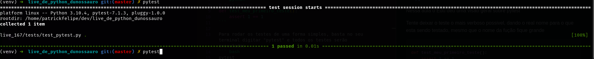
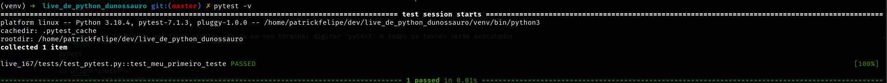
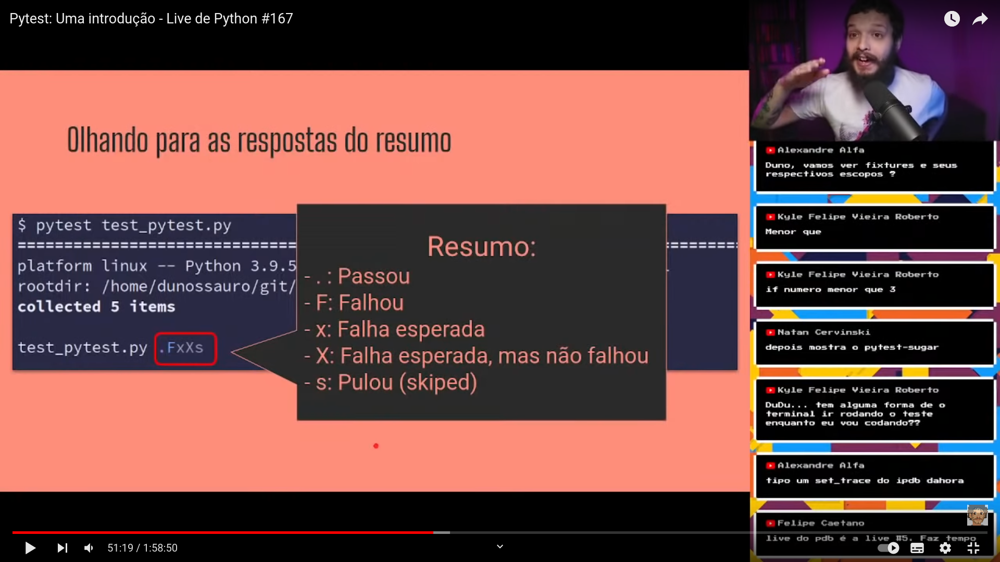
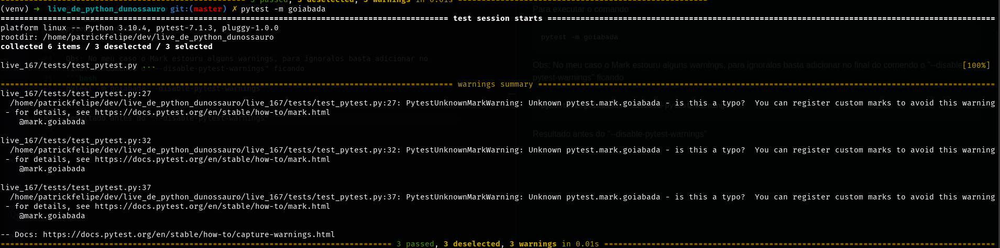
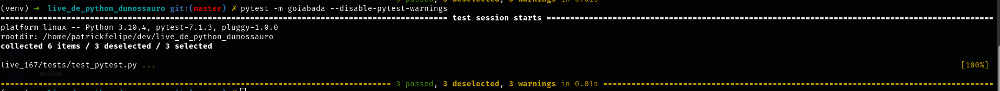
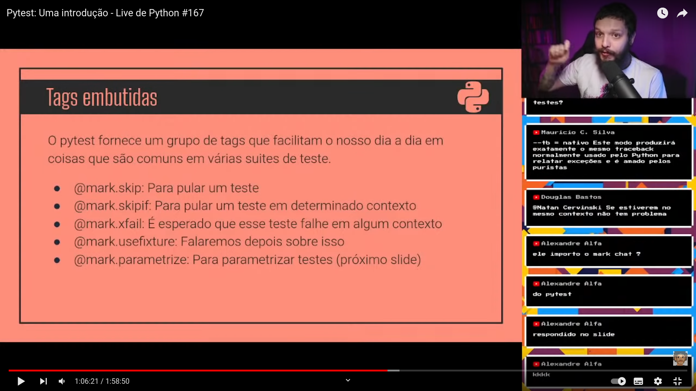
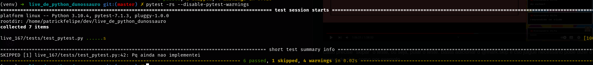

# Pytest: Uma introdução - Live de Python #167 
[Link da live no youtube](https://www.youtube.com/watch?v=MjQCvJmc31A&t=582s)

Nessa aula o Edu deu uma visão geral sobre pytest

Tente deixar o teste o mais verboso possivel, dando o real nome para o que esta sendo testado, mesmo que o nome da fução fique grande
``` python
# test_pytest.py
def test_meu_primeiro_teste():
    assert 1 == 1
```

Para rodar os testes de uma forma simples, basta no seu terminal digitar "pytest" e todos os testes serão executados
``` bash
pytest
```
<p align="center">
  
</p>

Para verificar exatamente qual teste rodou podemos executar com o `-v` (verbose)
``` bash
pytest -v
```
<p align="center">
  
</p>

Para verificar filtar pro algo digite `-k` e em aspas na frente o termo que deseja procurar para executar teste que tenham ele
``` bash
pytest -k "<term_filter>"
```

##### Dica Edu - [Time 40:28](https://youtu.be/MjQCvJmc31A?t=2428)
Toda vez que eu tiver um teste e a mensagem não for `AssertionError` significa que o que está errado é a estrutura do código e não efetivamente o que o teste testa.

Se deu `AssertionError` tudo deu certo exceto o resultado

Enquando estiver criando os testes pode ser interessante no momento que estourar o primeiro erro o pytest pare ali, para isso utilizamos o `-x`
``` bash
pytest -x
```

Outra dica seria usar o debugger `--pdb`
``` bash
pytest --pdb
```

Mais uma dica seria utilizar o `-s` para mostrar as saidas no console, como por exemplo um print
``` bash
pytest -s
```

#### Tipos de respostas do pytest - [Time 51:19](https://youtu.be/MjQCvJmc31A?t=3079)
<p align="center">
  
</p>

O pytest conta com uma ferramenta de report, o Junit
``` bash
pytest --junitxml report.xml
```

## Mark
O mark tem como propósito marcar testes específicos e facilitar rodar um certo grupo de testes

<strong>Exemplo:</strong> Para rodar testes que tenham um grupo de marcações taguiadas com "goiabada"
```python
# test_pytest.py
from pytest import mark

@mark.goiabada
def test_primeiro_teste():
  assert 1 == 1

def test_segundo_teste():
  assert 2 == 2

@mark.goiabada
def test_terceiro_teste():
  assert 3 == 3
```

Para executar o comando
```bash
pytest -m goiabada
```

Obs: No meu caso o Mark estouru alguns warnings, para ignoralos basta adicionar no final do comendo o `--disable-pytest-warnings` ficando
```bash
pytest -m goiabada --disable-pytest-warnings
```

Resultado antes do "--disable-pytest-warnings"
<p align="center">
  
</p>

Resultado depois do "--disable-pytest-warnings"
<p align="center">
  
</p>

Marcadores padrões do Mark -> [Time 1:07:32](https://youtu.be/MjQCvJmc31A?t=4052)
<p align="center">
  
</p>

Caso precise "skipar" o teste, ou seja, pular o teste. Basta adicionar o `@mark.skip` e caso julgue necessário pode dizer o motivo do skip, como por exemplo
```python 
# test_pytest.py
from pytest import mark

@mark.goiabada
def test_primeiro_teste():
  assert 1 == 1

@mark.skip(reason="Pq ainda nao implementei")
def test_segundo_teste():
  assert 2 == 2

@mark.goiabada
def test_terceiro_teste():
  assert 3 == 3
```


Obs: Para conseguir ver o `reason (motivo)` pelo qual o teste pulou, deve utilizar a flag `-r` e pra melhorar ainda mais utilize a `-s`, ficando:
```bash
pytest -rs
```

Resultado:
<p align="center">
  
</p>

Se usa o `@mark.xfail` quando sei que algo vai falhar, mas essa coisa tem que falhar e tem razão lógica pra isso kkkk by Edu
```python
# test_pytest.py
from pytest import mark
import sys

@mark.xfail(sys.platform=='win32', reason="Deve falhar no windowns")
def test_xfail_windowns():
  assert 1 == 2
```